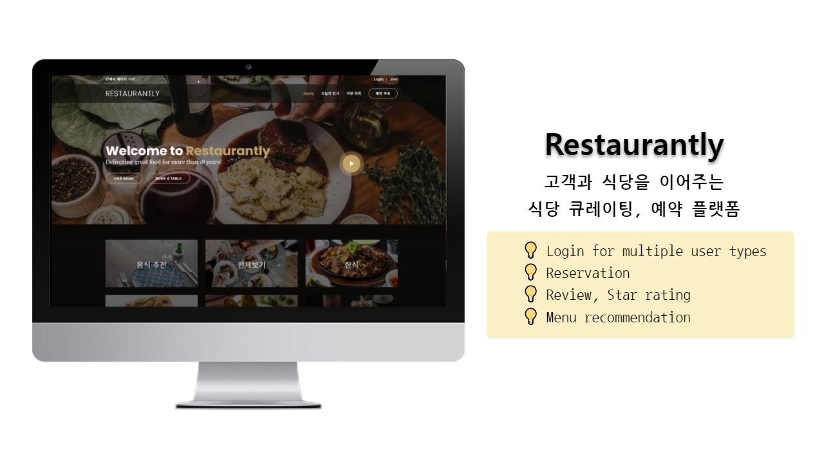
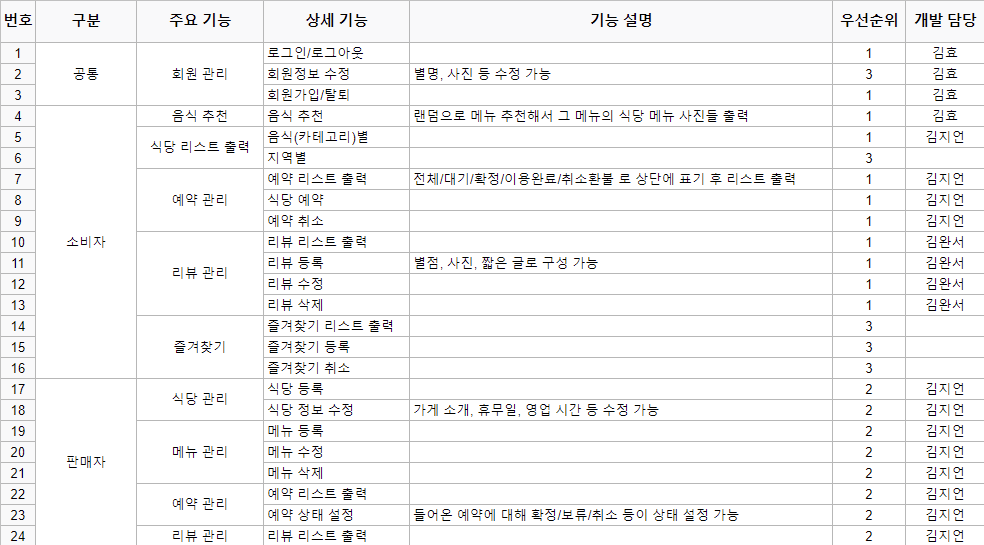
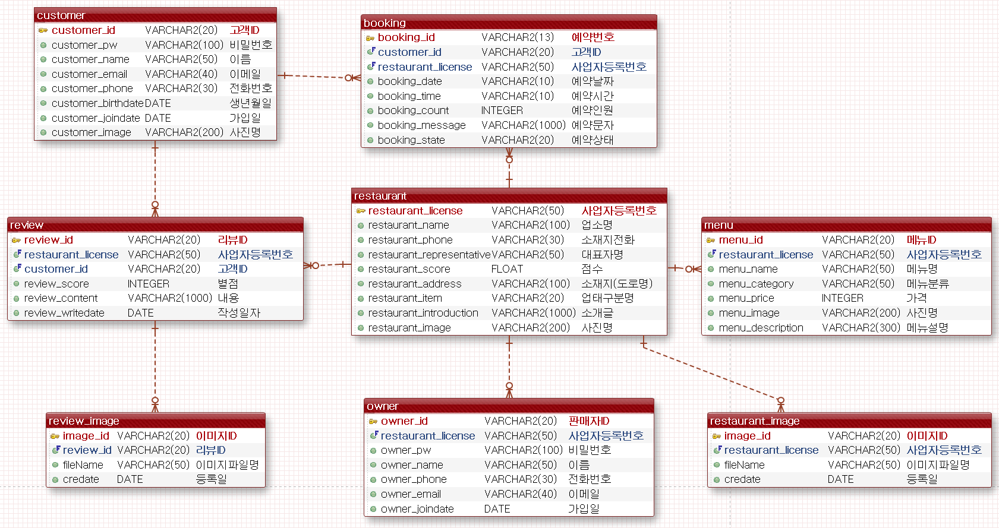
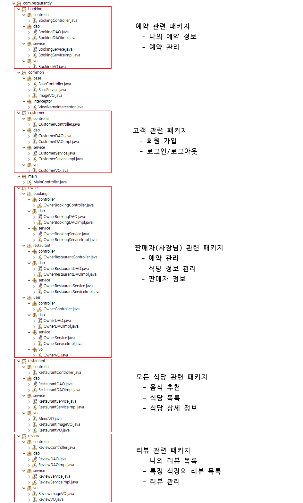
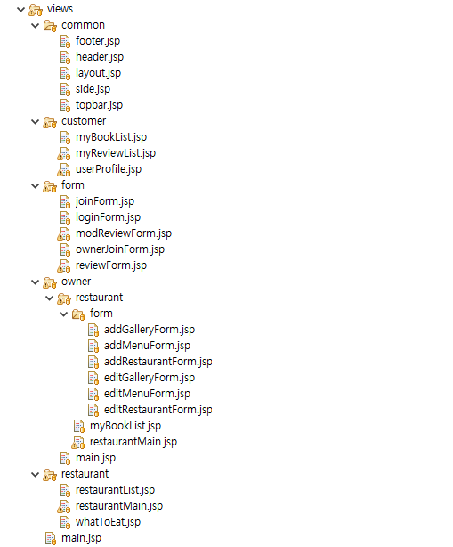

# Restaurantly
> 고객과 식당을 이어주는 식당 큐레이팅, 예약 서비스  
*Restaurant curating service that connects clients and restaurant owners. Informs users of restaurants’ menu and review; provides reservation and review services.*  

- 식당의 메뉴 정보와 평점 정보를 제공
- ‘고객’ 사용자에게는  예약, 리뷰, 메뉴 추천 서비스 제공
- ‘사장님’ 사용자에게는 식당, 메뉴 등록, 예약 승인 서비스 제공

## Introduction
### Features
1. Login for multiple user types
2. Board CRUD
3. Reservation
4. Review, Star rating
5. Menu recommendation

### Technologies used
|Tech|Stack|
|-|-|
|Language|Java, JavaScript|
|Backend|Spring Framework, MyBatis|
|Frontend|jQuery, Tiles|
|Database|Oracle|
|Server|Apache Tomcat|
|DevOps|Github|

### Created by
Jiun Kim & Wanseo Kim & Hyo Kim

 

# Tech Specification
## Requirements

## ERD

## Package Structure

## View Structure

 

# Web Page
## Main view

## Menu recommendation

